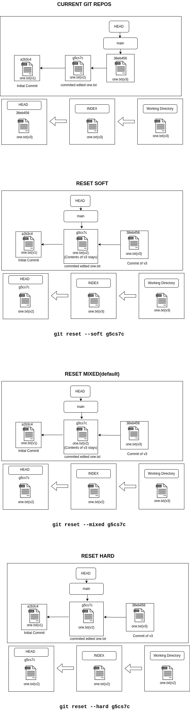
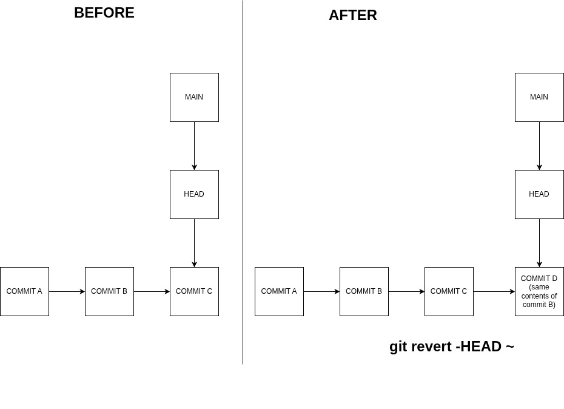

<h1 style = color:red;font-family:TimesNewRoman;>GIT & GITHUB</h1> 

### Git is a version control tool used to track changes in the file,manages different version of the file,able to work with others.
### GitHUB is a cloud based platform to store git repositories and enables collabration with others.
### Git has three states
     Working Tree/Directory
     Index(Staging)
     Git directory(repository)

Git Workflow

<h1 style = color:red;font-family:TimesNewRoman;>GIT INITIALIZE COMMANDS</h1> 

### ~git init -->It initialize the normal folder into git repository by adding .git folder into our project folder.
### ~git clone "url" -->It create a clone version of the github repository.
### ~git remote add origin "url" --> It is used to connect local git repository to gitHub repository
### ~git remote seturl origin "url" --> It is used to replace the origin url.

<h1 style = color:red;font-family:TimesNewRoman;>GIT ADD COMMANDS</h1> 

### ~git add "filename" --> It is used to move untracked/modified single file to staging area.

### ~git add . -->It is used to move entire untracked/modified files in the current folder to staging area.

### ~git add -A/~git add --all --> It is used to move entire untracked/modified files in the project folder to staging area.

### ~git add * --> It is used to move visible untracked/modified files in the project folder to staging area excluding deleted files.

<h1 style = color:red;font-family:TimesNewRoman;>GIT COMMIT COMMANDS</h1> 

### ~git commit -m "Commit message" --> It is used to move staged files to git repository with a commit message easily trackable.
### ~git commit -am "Commit message" --> It is used to move modified files to stageing area and git repository in one command.

Git Initial Commit  Workflow

Git Second Commit  Workflow

<h1 style = color:red;font-family:TimesNewRoman;>GIT RESET COMMANDS</h1> 

### ~git reset/~git reset -staged --> It is used to unstage all staged files
### ~git reset "filename"/~git reset -staged "filename" --> It is used to unstage specific file

### GIT reset commands for commit will not keep history

### ~git reset --soft HEAD~ --> It is used to roll back to last one commit version without making changes in current version.
### ~git reset --mixed HEAD~ --> It is used to roll back to last one commit without making changes in current version,but move them to staging area.
### ~git reset --hard HEAD~ --> It is used to roll back to last one commit with making changes in current version,also move them to working directory/modified files.

Git Reset  Workflow

<h1 style = color:red;font-family:TimesNewRoman;>GIT REVERT COMMANDS</h1> 

### GIT revert command is used to roll back to previous version,without affecting history.

### ~git revert -HEAD~ -->It is used to roll back to previous version by creating a new commit as same as the previous one.

Git Revert  Workflow

 
<h1 style = color:red;font-family:TimesNewRoman;>GIT BRANCH COMMANDS</h1> 

### ~git branch --> To check the availbale branches in the current repository.
### ~git branch "branchname" --> To create a new branch.
### ~git checkout/switch branchname --> To switch to that branch
### ~git branch -M oldbranchname newbranchname -->To change the branch name
### ~git branch -d branchname --> To delete a branch
### ~git branch -D branchname --> To force delete a branch

<h1 style = color:red;font-family:TimesNewRoman;>GIT DIFF COMMANDS</h1> 

### ~git diff "filename" -->used to compare single file.
### ~git diff --> used to compare working directory and staging area.
### ~git diff --staged --> used to compare staging area and last commit.
### ~git diff --HEAD -->used to compare working directory and last commit include staged and unstaged files.
### ~git diff branch1 branch2 -->used to compare two branches.
### ~git diff commit1 commit2 --. used to compare two commits.
### ~git diff --stat --> show only stats

<h1 style = color:red;font-family:TimesNewRoman;>GIT LOG COMMANDS</h1> 

### ~git log -->shows every commit logs
### ~git log --oneline --> shows the commit logs in one line
### ~git log --stat --> shows the stat of commits
### ~git log -p --> shows the exact line of code changed between commits
### ~git log --graph --shows the log of commits in branch
### ~git log --oneline --graph --all -->most useful command to show logs.
### ~git log --author -->shows commits of specific author made.
### ~git log --since --> shows commits after specific date.
### ~git log --until --> shows commits specific specific date.
### ~git log -n --> shows only certain number of commits.
### ~git log filename --> shows logs of specific file.
### ~git log branchname --> shows logs of specific branch.

<h1 style = color:red;font-family:TimesNewRoman;>GIT PUSH/PULL COMMAND</h1> 

### ~git push origin -u main -->Pushes everything from git to Github.
### ~git pull/git pull origin main -->Pulls everything from gitHub to git.
### ~git merge origin main -->merges into main branch.
### ~git fetch origin main -->fetch from main branch.
