<h1 style=color:orange> POSTMAN </h1>

### Postman’s API client enables you to create and send API requests, including HTTP, GraphQL, and gRPC requests. You can send a request to an endpoint, retrieve data from a data source, and test an API’s functionality.

<h2 style=color:orange>COLLECTION</h2>

### Collection is a group of saved API request to the endpoints Collections enable you to organize your requests using folders and subfolders according to the requirements of your API project.

### I created a Collection named Student_Collection to perform CRUD Operations

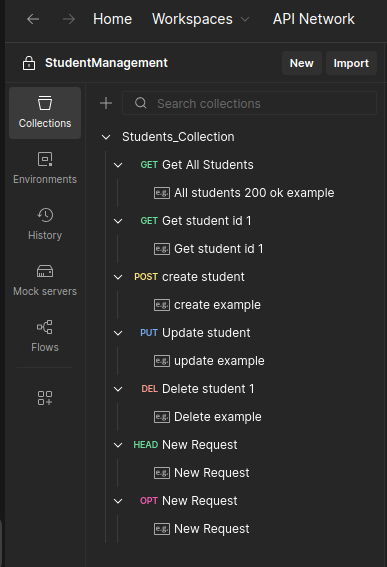

Collections

<h2 style=color:orange>REQUESTS</h2>

### Request is the process of access one application from another application over the internet using several API server.The most common is HTTP requests.

<h2 style=color:orange>DOCUMENTATION</h2>

### API documentation is a set of human-readable instructions for using and integrating with an API. Documentation includes information about an API’s endpoints, methods, resources, authentication protocols, parameters, and headers. It also includes examples of common requests and responses

<h2 style=color:orange>ENVIRONMENT</h2>

### Environment is postman is used to store and manage variables that can used across request.Instead of hardcoding values like URL and API keys,define them once and use them everywhere.
### postman support four variable scopes.
     1.Global variable-used across all workspaces,It is fixed
     2.Environment variable-Used across one workspace that inherit that environment.
     3.Collection variable-Used in all API request
     4.Local variable-also known as one request run

<h2 style=color:orange>MOCK SERVER</h2>

### Mock server is used for stimulate API request with predefined reponses without backend server.

<h2 style=color:orange>HTTP METHODS</h2>

     GET-Retrieve data
     POST-Create data
     PUT-Update entire data
     PATCH-Update specific feild
     DELETE-Delete data

<h2 style=color:orange>GET Method</h2>

### Get method used to Read all resources available at the endpoints.I created a mock server and Perform GET Method at {{baseURL}}/students.

### {{baseURL}} is the Environment Variable i created for this workspace

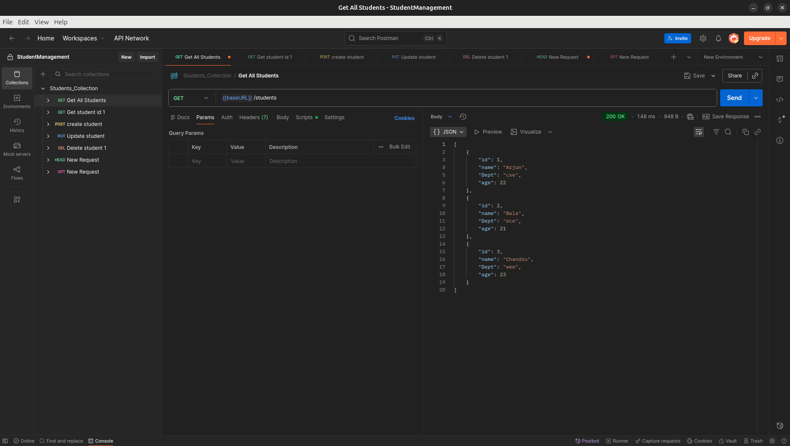

Read all records

### Getting records of id=1

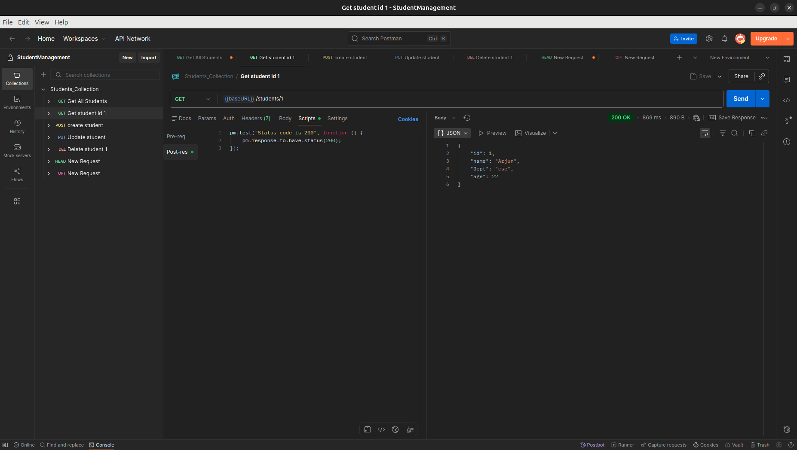

Read records of id=1

<h2 style=color:orange>POST Method</h2>

### POST method is used for create a new record.I created a new student at the same /students endpoint

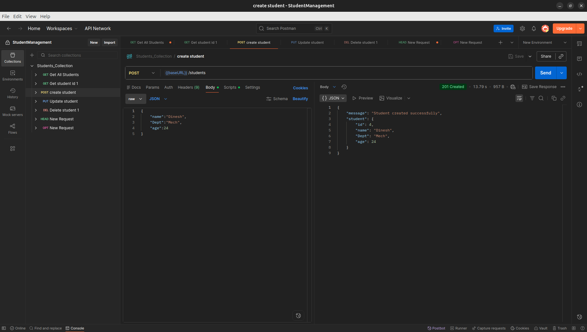

Create a new Record

<h2 style=color:orange>PUT Method</h2>

### PUT method is used to update entire resource.I performed the update process using PUT method

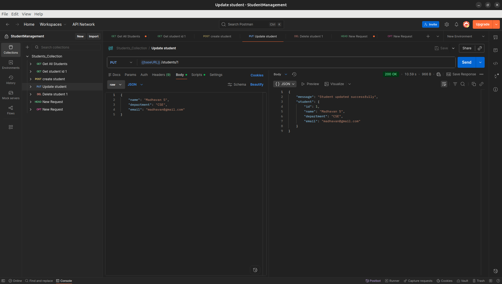

update a Record

<h2 style=color:orange>DELETE Method</h2>

### Delete method is used for Deleting records.I performed the Delete method.

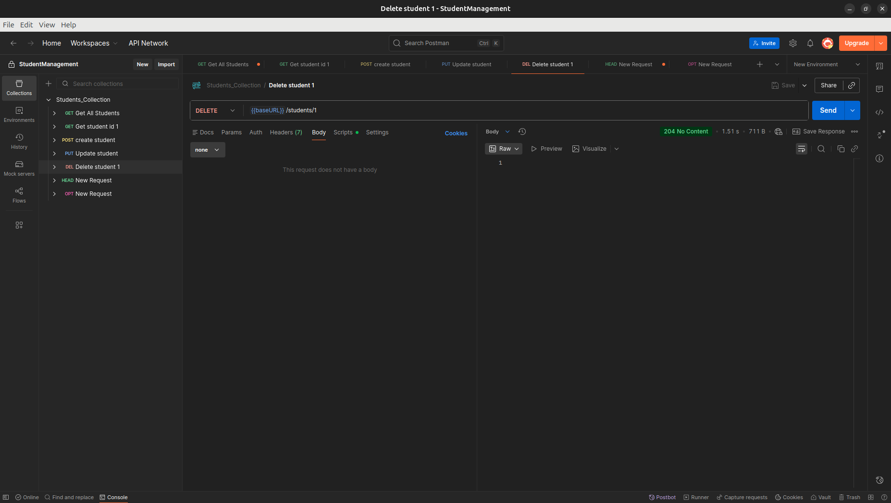

Delete Record

<h2 style=color:orange>HEAD Method</h2>

HEAD method is also HTTP method ,it returns the header value in the response.

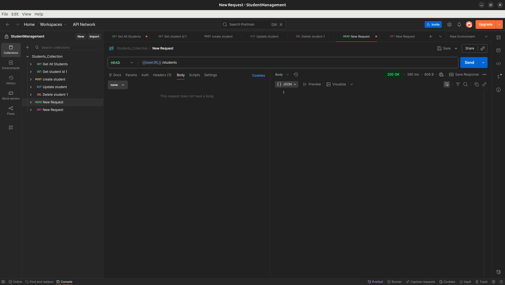

Get Header of a request

<h2 style=color:orange>OPTION Method</h2>

OPTION method is used to view which methods are allowed to request to the server. 

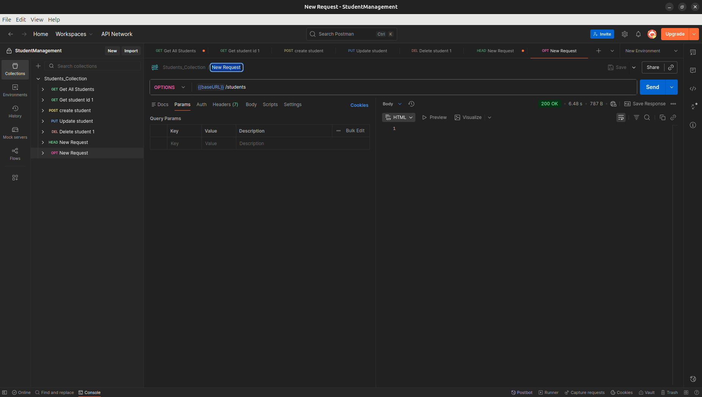

Get which method allow

<h2 style=color:orange>STATUS CODE</h2>

### Status Codes are 3 digit numeric combination returned by the server represent result of HTTP request

    200-Request completed successfully
    201-A new resource was created
    204-Request success but no content
    301-Resource moved permanantly
    302-Temprorily redirect
    400-Bad request
    401-Authentication failed
    403-Authorisation failed
    404-Not found
    422-Validation failed even though request format is correct
    500-Unexpected server side error

<h2 style=color:orange>TESTING SCRIPTS</h2>

### Testing scripts is used by attach JavaScript scripts to your API requests to automate workflows, validate responses, and dynamically control request behavior

### Commonly there are two testing scripts,
     Pre Request Script
     Post Request Script

<h2 style=color:orange>PRE REQUEST SCRIPTS</h2>

### Pre request scripts execute before the API request.
        Set or validate variables
        Configure authentication headers
        Pass data between requests
        Log request details

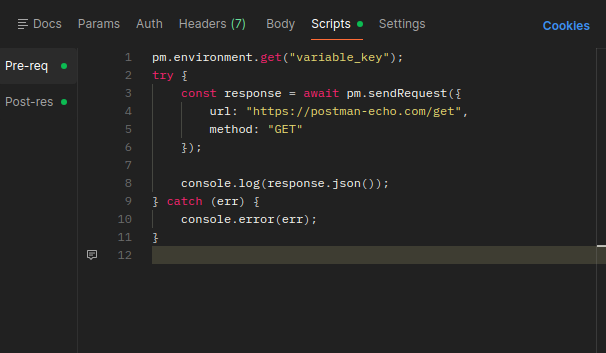

Pre Request Test Script

<h2 style=color:orange>POST REQUEST SCRIPTS</h2>

### Pre request scripts execute after the API request.
        Check status codes and response bodies
        Validate JSON structure
        Set variables from the response
        Log for debugging

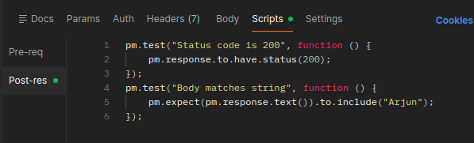

Post Request Test Script

<h2 style=color:orange>AUTHORISATION</h2>

### Authorisation is the process of what are the resources or action can be performed by an authenticated user.

### Various types Authorisation used by Postman is

        API KEY
        JWT Token
        OAuth 1.0
        OAuth 2.0
        Bearer Token

### I Created an Payment Api workspace to perform authorisation.I entered the bearer token as variable name "token" and use it among the collection requests.

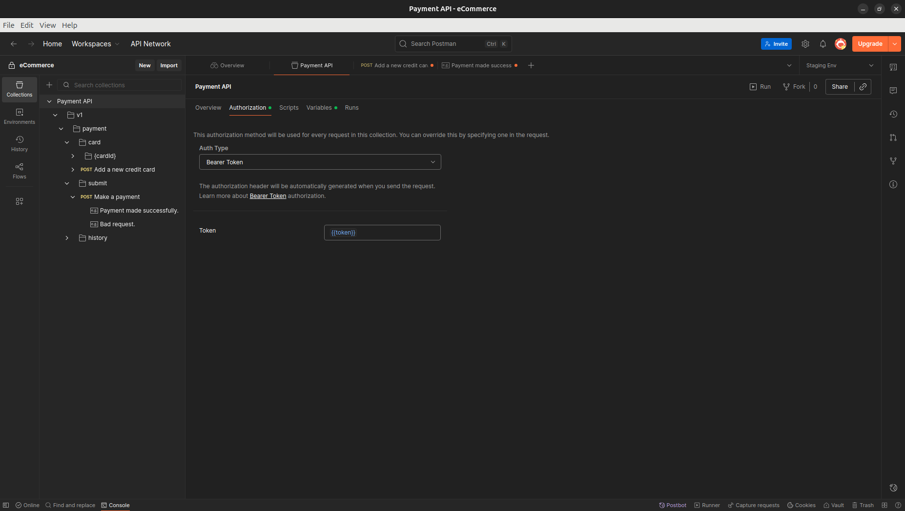

Authorisation

<h2 style=color:orange>COLLECTION RUNNER</h2>

### A Collection Runner in Postman is a feature that lets you run multiple API requests automatically from a collection, one after another, without manually clicking Send for each request.

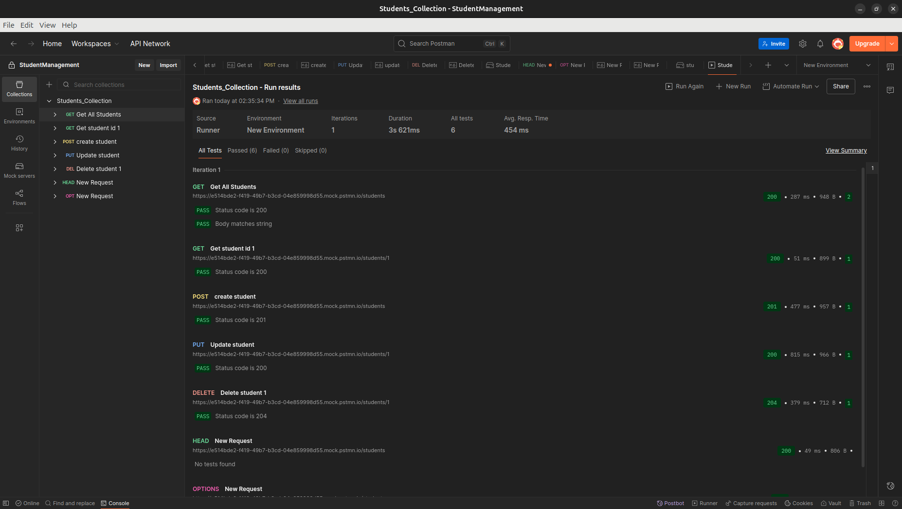

Collection Runner

